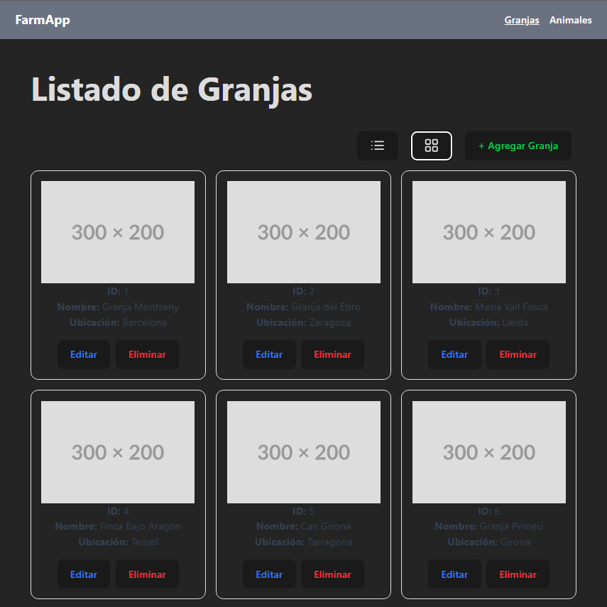
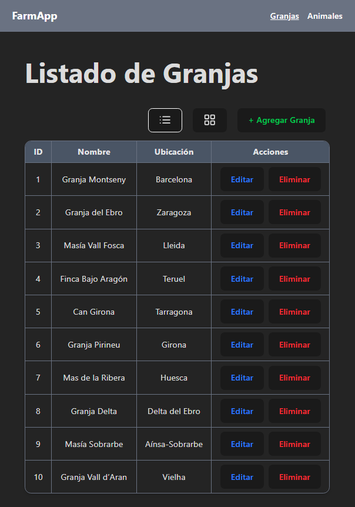

# 🐄 Farm App

Aplicación para la gestión de granjas y animales. Este proyecto está dividido en dos partes:

- **Frontend**: Vite + React + TypeScript + TailwindCSS + SW.
- **Backend**: Node.js + Express + Sequelize + MySQL.

Este proyecto sirve como base para sistemas de gestión modernos con arquitectura desacoplada y escalable. Ideal para ampliar con autenticación, roles, graficado de datos u otros dominios.

---

## 💻 App Snapshots

- ### Farms Card View



- ### Farms List View



## 📁 Estructura del proyecto


```
farm-app
├─ backend
│  ├─ package-lock.json
│  ├─ package.json
│  ├─ queries.sql
│  ├─ src
│  │  ├─ features
│  │  │  ├─ animal
│  │  │  │  ├─ animal.controller.ts
│  │  │  │  ├─ animal.middleware.ts
│  │  │  │  └─ animal.service.ts
│  │  │  └─ farm
│  │  │     ├─ farm.controller.ts
│  │  │     ├─ farm.middleware.ts
│  │  │     └─ farm.service.ts
│  │  ├─ models
│  │  │  ├─ animal.model.ts
│  │  │  └─ farm.model.ts
│  │  ├─ scripts
│  │  │  └─ seed.ts
│  │  └─ server.ts
│  └─ tsconfig.json
└─ frontend
   ├─ README.md
   ├─ eslint.config.js
   ├─ index.html
   ├─ package-lock.json
   ├─ package.json
   ├─ src
   │  ├─ App.css
   │  ├─ App.tsx
   │  ├─ assets
   │  ├─ components
   │  │  ├─ animal
   │  │  │  └─ AnimalForm.tsx
   │  │  ├─ farm
   │  │  │  └─ FarmForm.tsx
   │  │  ├─ nav
   │  │  │  └─ Navbar.tsx
   │  │  └─ ui
   │  │     ├─ SelectBox.tsx
   │  │     └─ Spinner.tsx
   │  ├─ config.ts
   │  ├─ index.css
   │  ├─ main.tsx
   │  ├─ models
   │  │  ├─ animalModel.ts
   │  │  ├─ animalWithFarm.ts
   │  │  ├─ farmModel.ts
   │  │  └─ fieldDefinitionModel.ts
   │  ├─ pages
   │  │  ├─ AnimalsPage.tsx
   │  │  └─ FarmsPage.tsx
   │  ├─ services
   │  │  └─ api.service.ts
   │  ├─ utils
   │  │  └─ confirmDialog.ts
   │  └─ vite-env.d.ts
   ├─ tests
   │  └─ Card.test.tsx
   ├─ tsconfig.app.json
   ├─ tsconfig.json
   ├─ tsconfig.node.json
   └─ vite.config.ts

```

---

## 🚀 Requisitos

- Node.js (v18 o superior)
- MySQL (local o remoto)
- [VSCode](https://code.visualstudio.com/) (opcional, para usar tareas desde `.vscode/tasks.json`)

---

## ⚙️ Variables de entorno

En la carpeta `backend/`, crea un archivo `.env` con los siguientes valores:

```env
DB_DIALECT=mysql
DB_HOST=localhost
DB_USER=tu_usuario
DB_PASSWORD=tu_contraseña
DB_NAME=farm_app_db
DB_PORT=3306
```
En la carpeta `frontend/`, crea un archivo `.env` con los siguientes valores:

```env
VITE_API_BASE_URL=url_api
```


---

## 🖥️ Instrucciones de arranque

### Backend

```bash
cd backend
npm install        # Instalar dependencias
npm run dev        # Levanta el servidor en modo desarrollo
```

La API se expondrá por defecto en http://localhost:3000.

La base de datos se sincroniza automáticamente al arrancar el backend si `sequelize.sync()` está habilitado.

### Frontend

```bash
cd frontend
npm install        # Instalar dependencias
npm run dev        # Levanta Vite en modo desarrollo
```

La aplicación estará disponible en http://localhost:5173.

---

## 🌱 Script de relleno de datos (seed)

Para poblar la base de datos con datos de ejemplo (granjas y animales), puedes ejecutar el siguiente script ubicado en `backend/src/scripts/seed.ts`.

### Pasos:

1. Asegúrate de tener configurada y conectada la base de datos correctamente.
2. Abre una terminal en la carpeta `backend/`.
3. Ejecuta el comando:

```bash
npx ts-node src/scripts/seed.ts
```

## ✅ Ejecutar pruebas con Vitest

Dentro de la carpeta `frontend`, puedes correr los tests ejecutando:

```bash
npm run test
```

Vitest está configurado para pruebas unitarias en componentes y utilidades.

---

## ⚡ Ejecutar todo desde VSCode

Para facilitar el desarrollo, puedes ejecutar ambos servidores a la vez usando tareas de VSCode.

### Usar `.vscode/tasks.json`

1. Abre el proyecto en VSCode.
2. Presiona `Ctrl+Shift+P` o `Cmd+Shift+P` en macOS.
3. Escribe `Run Task` y selecciona `Tasks: Run Task`.
4. Elige la tarea llamada **Start All**.

Esto iniciará tanto el frontend como el backend simultáneamente en terminales separadas.

---

## ✨ Extras

- El backend implementa validaciones básicas con middlewares.
- Puedes eliminar, editar y listar granjas y animales.
- Relación 1:N entre granja y animales.

---

## 📌 Scripts útiles

### Backend

```bash
npm run dev       # Arranca el servidor con hot reload
npm run build     # Compila el código (si está configurado)
```

### Frontend

```bash
npm run dev       # Levanta el servidor Vite
npm run build     # Compila el frontend para producción
npm run preview   # Sirve el build final para comprobarlo
npm run test      # Ejecuta los tests con Vitest
```

---

## 🧑‍💻 Autor

Proyecto desarrollado como práctica de gestión de datos con frontend moderno y backend RESTful.

